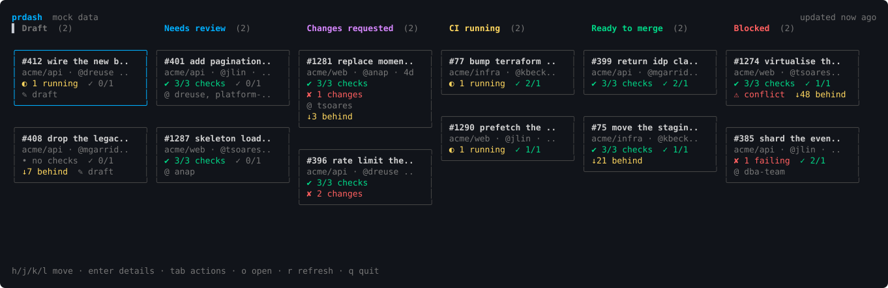

# prdash

A terminal board of your open GitHub pull requests across one or more repositories, plus a
CI health screen.



## Installation

Requires [`gh`](https://cli.github.com) installed and authenticated — `prdash` uses your
existing `gh` credentials and never handles tokens itself.

```sh
gh auth login
```

### Download a release

Grab the archive for your platform from the [releases page](../../releases), verify it
against `checksums.txt`, then put the binary on your `PATH`:

```sh
tar -xzf prdash_v0.1.0_darwin_arm64.tar.gz
sudo mv prdash_v0.1.0_darwin_arm64/prdash /usr/local/bin/
```

Builds are published for Linux, macOS and Windows on both amd64 and arm64.

### Install with Go

```sh
go install github.com/dreuse/prdash@latest
```

### Build from source

```sh
git clone https://github.com/dreuse/prdash.git
cd prdash
go build -o prdash .
```

### Run it

First run asks for a repository and a default view, then goes straight into the dashboard.

```sh
prdash
prdash acme/api acme/web acme/infra   # adds repositories to the stored list
prdash --view ci                      # override the default view for one run
prdash --ascii                        # ascii glyphs for one run
prdash --mock                         # explore the ui without credentials
```

`NO_COLOR=1` and light-background terminals are both supported; no information is carried
by colour alone.
