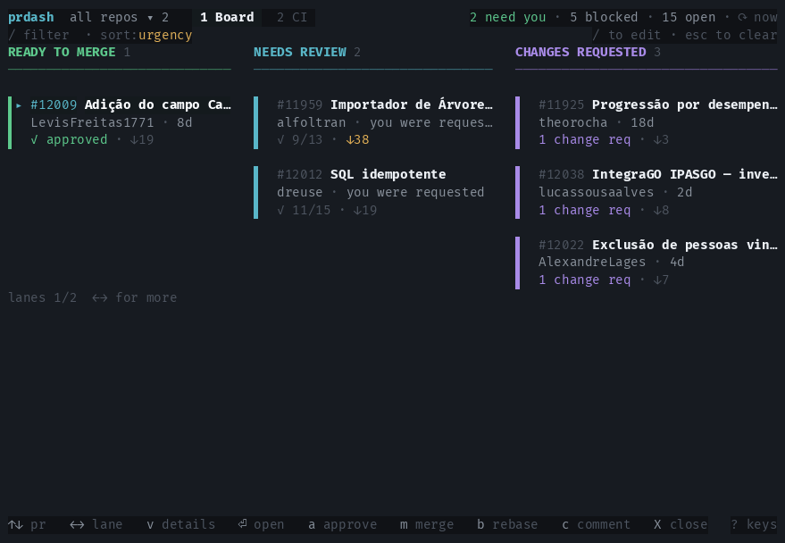

# prdash

A terminal board of your open GitHub pull requests across one or more repositories, plus a
CI health screen.



<sub>Static view: [docs/screenshot.svg](docs/screenshot.svg)</sub>

## Installation

Requires [`gh`](https://cli.github.com) installed and authenticated — `prdash` uses your
existing `gh` credentials and never handles tokens itself.

```sh
gh auth login
```

### Install script

macOS and Linux:

```sh
curl -fsSL https://raw.githubusercontent.com/dreuse/prdash/main/install.sh | sh
```

Windows:

```powershell
irm https://raw.githubusercontent.com/dreuse/prdash/main/install.ps1 | iex
```

Both download the release for your platform, check it against `checksums.txt`, and drop
the binary in `~/.local/bin` (`%LOCALAPPDATA%\prdash\bin` on Windows). Set
`PRDASH_INSTALL_DIR` to install elsewhere, or `PRDASH_VERSION=v0.1.0` to pin a release.

### Download a release

Grab the archive for your platform from the [releases page](../../releases), verify it
against `checksums.txt`, then put the binary on your `PATH`:

```sh
tar -xzf prdash_v0.1.0_darwin_arm64.tar.gz
sudo mv prdash_v0.1.0_darwin_arm64/prdash /usr/local/bin/
```

Builds are published for Linux, macOS and Windows on both amd64 and arm64.

### Install with Go

```sh
go install github.com/dreuse/prdash@latest
```

### Build from source

```sh
git clone https://github.com/dreuse/prdash.git
cd prdash
go build -o prdash .
```

### Keep it updated

The running version sits in the bottom right of the dashboard. `prdash` checks for a newer
release on start and, when there is one, says so once and leaves `v0.2.0 → v0.3.0` in that
corner for the rest of the session. Install it over the running binary with:

```sh
prdash --update
prdash --version
```

The download goes through `gh` and is checked against the release `checksums.txt` before
anything is replaced. If you installed with `go install` or a package manager, update the
same way you installed instead.

### Run it

First run asks for a repository and a default view, then goes straight into the dashboard.

```sh
prdash
prdash acme/api acme/web acme/infra   # adds repositories to the stored list
prdash --view ci                      # override the default view for one run
prdash --ascii                        # ascii glyphs for one run
prdash --mock                         # explore the ui without credentials
```

`NO_COLOR=1` and light-background terminals are both supported; no information is carried
by colour alone.

## Lanes

The board ships with six lanes and two orderings — `ready` puts what you can merge first,
`pipeline` follows the order work moves through. Set `Lane order` to `custom` in the BOARD
section of the settings overlay (`,`) and the lanes become yours: each one is a name and a
rule, matched top to bottom, first match wins.

```
BOARD         c colour · s sort · J/K move · d remove
  Lane order            ‹ custom ›
  ▌ MERGE NOW           is:ready ▌
  ▌ ON ME               reviewer:@me -is:draft ▌ age
  ▌ BROKEN              is:conflict,failing,blocked ▌
  add lane…             ⏎ edit
```

`enter` on `add lane…` takes `NAME | rule`. On a lane, `enter` edits the rule, `c` cycles
its colour, `s` gives it a sort of its own, `J`/`K` move it and `d` removes it. Anything no
rule claims lands in an `OTHER` lane at the end; write a lane with the rule `*` to name that
lane yourself.

Rules use the same syntax as the `/` filter bar, so you can try one there before making it a
lane. `-` negates, commas are or, spaces are and, and values with spaces need quoting —
`label:"needs product review"`. `state:` is the one key a lane cannot use, since that is
what the lane is deciding.

| Key | Values |
| --- | --- |
| `is:` | `ready` `running` `failing` `blocked` `conflict` `changes-requested` `behind` `draft` `stale` `approved` |
| `author:` `assignee:` `reviewer:` | a login, `@me`, `any`, `none` |
| `repo:` `label:` | substring, exact |
| `approvals:` `behind:` `age:` | `>=2`, `>50`, `>7d` |
| `no:` | `assignee` `reviewer` `label` |

## Keys

Motions follow vi: `j` `k` `h` `l` to move, `gg` and `G` for the ends, `ctrl-d` / `ctrl-u` for
half a page, `ctrl-f` / `ctrl-b` for a full one. `tab` moves into the detail pane and back,
`+` and `-` resize it, and the size is remembered. Inside a diff, `}` and `{` step through
hunks and `]c` / `[c` through files. Press `?` for the full list, which always shows the keys
that are actually bound.

Any action can be rebound from `keys` in `settings.json`:

```json
{
  "keys": {
    "diff": "D",
    "approve": "ctrl+a",
    "split": "space v"
  }
}
```

Values are space separated, so an action can answer to several keys. Taking a key that another
action already owns moves it — bind `split` to `S` and `S` stops opening the settings overlay.
`ctrl-c` always quits, whatever the file says. Unknown action names are ignored. The action
names are listed at the bottom of the `?` screen.

## Notifications

Everything here is off by default and lives in the NOTIFICATIONS section of the settings
overlay (`,`). Alerts go out through `osascript` on macOS, `notify-send` on Linux, and an
OSC 9 escape everywhere else.

| Setting | Fires when |
| --- | --- |
| Runs that finish | a workflow run lands — `failures` or `all` |
| Reviews | someone approves or requests changes |
| Ready to merge | a pull request clears every check and approval |
| Handed to you | you are assigned or your review is requested |

`Scope` narrows the first three: `any` pull request, `mine` for the ones you opened or were
assigned, `authored` for only the ones you opened. "Handed to you" ignores the scope, since
work arriving from someone else is the point. Under `mine` and `authored`, runs with no pull
request behind them — a push to `main`, a nightly job — stay silent.

Notifications need prdash to be running. With any of them on it keeps polling at the normal
interval instead of backing off to five minutes when the terminal loses focus.
